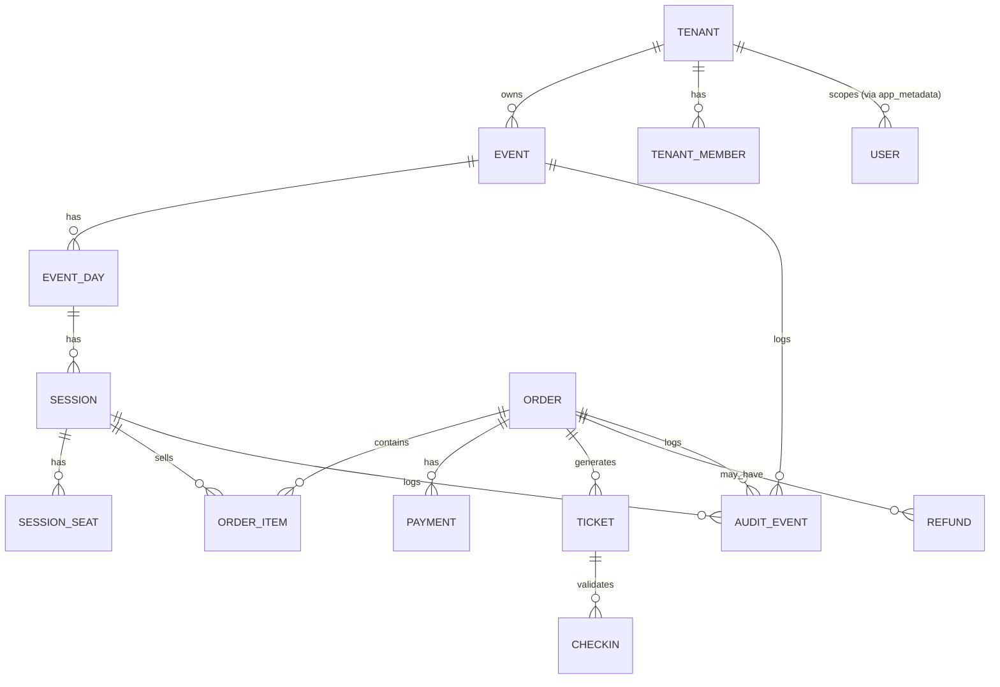
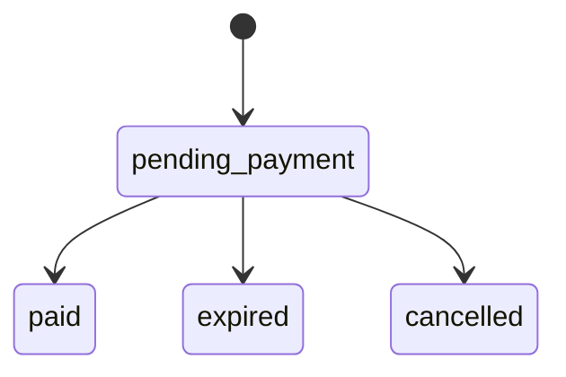
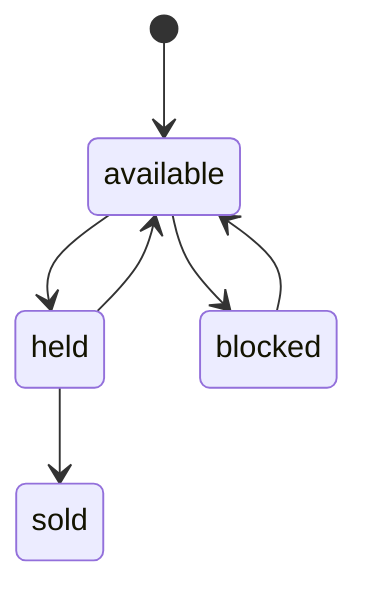

# Documento 3 - Modelo de Domínio (Revisado)

## Objetivo
Definir entidades, relacionamentos, estados e invariantes do domínio de negócio do MVP.

## Contexto
O domínio precisa suportar evento em múltiplos dias, com N sessões por dia, e venda por sessão com assento reservado quando aplicável.

## Decisões Fechadas
- Estrutura principal: `Event -> EventDay -> Session`.
- Regra de venda: `1 ingresso = 1 sessão`.
- Assentos independentes por sessão.
- Mapa de assentos em hierarquia `Setor -> Fileira -> Assento`.
- Identidade do assento por `setor + fileira + número`.
- Unicidade de número do assento por fileira.
- Preço único por sessão no MVP.
- Hold de inventário com TTL de 10 minutos.
- Sem transferência de ingresso no MVP.

## Entidades Principais
- `Tenant`: organizador, subdomínio e branding. Campo opcional `maxUsers` (limite de usuários do tenant; default de config global). Ver Documento 18.
- `CommercialPolicy`: versão de regras comerciais por tenant (taxas, janelas e motivos de reembolso).
- `User`: identidade no Supabase Auth; perfil e escopo de acesso (role, tenant_id) em app_metadata. No banco de domínio, espelho de membros por tenant: `TenantMember` (tenant_id, auth_user_id, role) para listagem e contagem (Documento 18).
- `TenantMember`: associação usuário-tenant com role; espelho para leitura e limite; fonte de verdade de role/tenant_id permanece no Supabase Auth (app_metadata).
- `Event`: agregador comercial do evento.
- `EventDay`: data de ocorrência do evento.
- `Session`: unidade vendável e checkável.
- `VenueMapTemplate`: mapa base de assentos.
- `SectorTemplate`, `RowTemplate`, `SeatTemplate`: estrutura física base.
- `SessionSeat`: assento operacional por sessão.
- `Order` e `OrderItem`: pedido e itens de compra.
- `OrderFinancialSnapshot`: composição financeira congelada do pedido.
- `Payment`: estado financeiro da cobrança.
- `Ticket`: ingresso com QR e status.
- `CheckIn`: tentativa de validação de entrada.
- `Refund`: estorno manual do pedido.
- `AuditEvent`: trilha de eventos críticos.

## Chaves e Restrições de Unicidade
- `SessionSeat`: único por `(session_id, sector_code, row_label, seat_number)`.
- `Ticket.qr_code`: único por sessão.
- `CheckIn`: apenas um check-in aprovado por ticket.
- `Order.idempotency_key`: única por escopo de criação de pedido.
- `CommercialPolicy.version`: única por tenant.
- `TenantMember`: único por (tenant_id, auth_user_id).

## Relacionamentos (visão ER simplificada)

## Estados e Transições
- `Order.status`: `pending_payment -> paid | expired | cancelled`
- `Payment.status`: `pending -> approved | denied | refunded | error`
- `Ticket.status`: `valid -> used | cancelled`
- `SessionSeat.status`: `available -> held -> sold`, `held -> available`, `available <-> blocked`

## Invariantes do Domínio
- Não existe ticket `valid` sem `Order` pago.
- Mesmo QR não pode ter dois check-ins aprovados.
- Assento `sold` não volta para `held`.
- Assento `blocked` não pode ser vendido.
- Nenhuma leitura ou escrita cruza `tenant_id`.
- Venda + hold não pode exceder capacidade da sessão.
- Todo pedido deve possuir snapshot financeiro com versão de política comercial aplicada.

## Regras Finas de Ciclo de Vida
- Hold expirado sempre retorna `SessionSeat` para `available`.
- Pagamento aprovado após pedido `expired` não emite ticket automaticamente; gera pendência de tratamento financeiro.
- Reembolso por cancelamento (total ou parcial) cancela ticket e libera inventário apenas quando aplicável à sessão.

## Regras e Critérios de Aceite
- Modelo de domínio deve mapear todos os fluxos do MVP.
- Estados devem ter transições explicitamente definidas.
- Invariantes devem ser testáveis por cenário de negócio.

## Riscos e Limitações
- Operação multi-sessão exige controle rigoroso de concorrência.
- Evolução futura para preço por setor/assento exigirá extensão de modelo.

## Changelog
- `v1.3.0` - 2026-02-15 - Tenant com campo opcional maxUsers; TenantMember para espelho de usuários por tenant (listagem e limite); User esclarecido como identidade no Supabase Auth com escopo em app_metadata. Documento 18.
- `v1.2.0` - 2026-02-14 - Inclusão de política comercial versionada e snapshot financeiro no domínio.
- `v1.1.0` - 2026-02-14 - Inclusão de chaves/restrições e regras finas de ciclo de vida.
- `v1.0.0` - 2026-02-14 - Versão inicial revisada.
