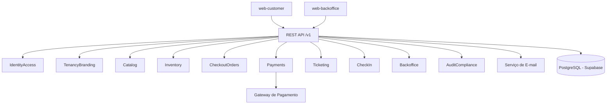

# Documento 4 - Arquitetura de Alto Nível

## Objetivo
Definir a arquitetura técnica do MVP, com fronteiras claras entre módulos e integrações externas.

## Contexto
A prioridade do MVP é velocidade de entrega com confiabilidade operacional. A escolha técnica base é monólito modular com fluxos síncronos.

## Decisões Fechadas
- Estilo: monólito modular.
- Interface backend: REST/JSON.
- Processamento interno: síncrono em todas as operações nesta fase.
- Persistência inicial: PostgreSQL gerenciado no Supabase.
- Isolamento de organizadores por `tenant_id`.
- Integrações externas obrigatórias: gateway de pagamento e e-mail transacional.

## Princípios Arquiteturais
- Consistência forte para operações financeiras e inventário.
- Idempotência obrigatória em operações críticas.
- Fail-safe em fluxos de venda: nunca vender sem inventário confirmado.
- Observabilidade desde o MVP para operação em evento real.

## Módulos Internos
- `IdentityAccess`: autenticação via Supabase Auth e RBAC.
- `TenancyBranding`: resolução por subdomínio e configuração white-label.
- `Catalog`: evento, dia, sessão e mapa de assentos.
- `Inventory`: hold, expiração, bloqueio e venda.
- `CheckoutOrders`: pedido e cálculo de totais/taxas.
- `Payments`: cobrança, webhook, conciliação.
- `Ticketing`: emissão de QR e estado de ingresso.
- `CheckIn`: validação de QR e prevenção de reuso.
- `Notifications`: envio de e-mail transacional.
- `Backoffice`: operação de organizer admin e platform admin.
- `AuditCompliance`: trilha de auditoria e suporte a LGPD.

## Visão de Componentes

## Fluxos Transacionais Críticos
- Reserva de assento (`hold`) e criação de pedido devem ocorrer em transação consistente.
- Confirmação de pagamento e conversão de inventário para `sold` devem ser atômicas.
- Emissão de ticket deve ocorrer após confirmação de pagamento persistida.

## Dados e Persistência
- Banco relacional único no MVP.
- Todas as tabelas de negócio com chave de escopo por tenant.
- Listagens e busca por query relacional (sem motor dedicado neste ciclo).

## Segurança e Observabilidade
- JWT emitido pelo Supabase Auth para autenticação.
- RBAC por papel: `platform_admin`, `organizer_admin`, `operator`, `buyer`.
- TLS em trânsito e criptografia de dados sensíveis em repouso.
- Logs estruturados com `trace_id` e monitoramento operacional em stack compatível com Vercel.

## Regras e Critérios de Aceite
- Fronteiras de módulo devem reduzir acoplamento entre domínios.
- Integrações externas devem suportar idempotência e tratamento de erro explícito.
- Arquitetura deve comportar piloto sem depender de microserviços.

## Riscos e Limitações
- Monólito modular requer disciplina para manter limites de domínio.
- Processamento totalmente síncrono pode elevar latência em integrações externas.

## Changelog
- `v2.3.0` - 2026-02-14 - Adoção do Supabase Auth como provider de autenticação.
- `v2.2.0` - 2026-02-14 - Atualização da persistência para PostgreSQL gerenciado no Supabase.
- `v2.1.0` - 2026-02-14 - Ajuste de observabilidade para modelo de deploy backend na Vercel.
- `v2.0.0` - 2026-02-14 - Ajuste para modelo síncrono com visão de dois frontends.
- `v1.1.0` - 2026-02-14 - Regras finas de consistência transacional.
- `v1.0.0` - 2026-02-14 - Versão inicial.
