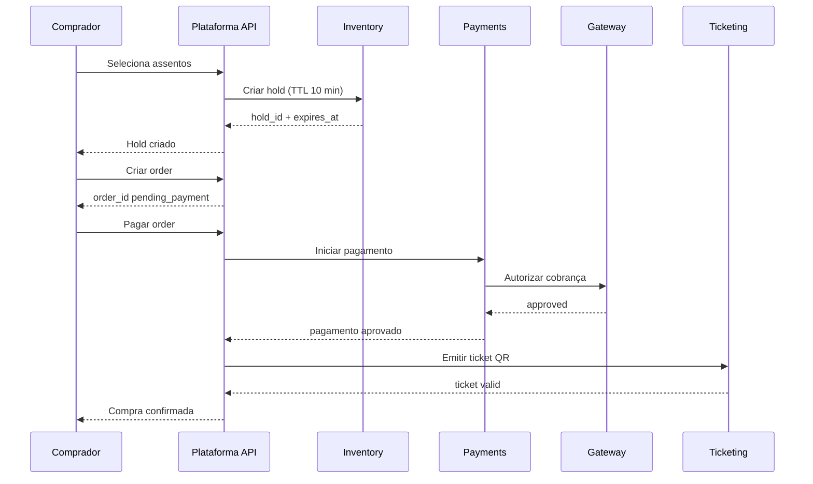
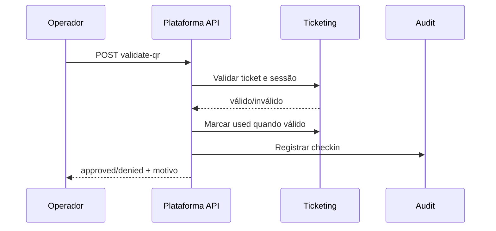
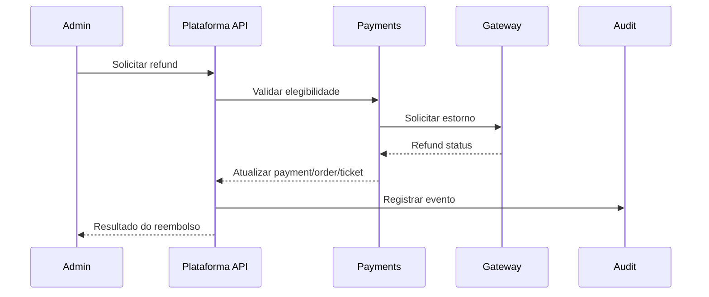
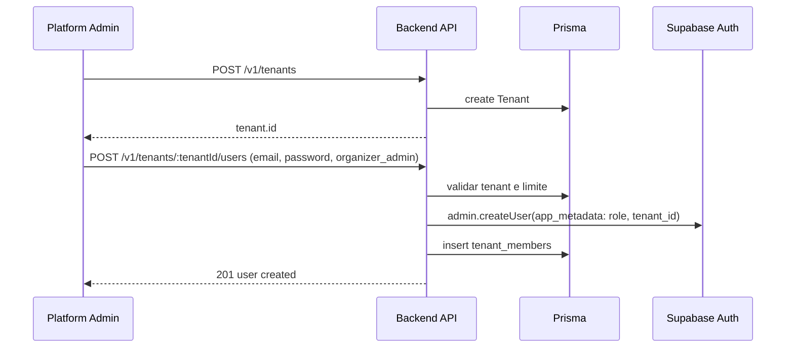

# Documento 6 - Fluxos de Usuário (Journeys)

## Objetivo
Descrever jornadas ponta a ponta do MVP, com passos operacionais e tratamentos de falha.

## Contexto
As jornadas cobrem compra, pagamento, emissão de ticket, check-in e reembolso manual.

## Decisões Fechadas
- Formato padrão por jornada: Atores, Pré-condições, Passos, Pós-condições, Exceções.
- Cobertura de exceções: extensa.
- Check-in offline: fora do MVP.
- Timeout de pagamento pendente: pedido expira (`expired`) e hold é liberado.
- Falha de envio de e-mail: ticket permanece disponível no portal e suporte executa reenvio manual.
- Reembolso manual segue matriz temporal e motivos definidos no Documento 9.

## Jornada 1 - Compra e Reserva de Inventário
### Atores
Comprador.

### Pré-condições
- Sessão publicada.
- Inventário disponível.

### Passos
1. Comprador seleciona sessão e assentos/quantidade.
2. Sistema cria `hold` com expiração em 10 minutos.
3. Comprador informa dados para pedido.
4. Sistema cria `Order` em `pending_payment`.

### Pós-condições
Pedido criado e inventário temporariamente reservado.

### Exceções
- Assento indisponível durante seleção.
- Hold expirado antes da criação do pedido.
- Divergência de valor no fechamento.
- Tentativa de reserva em sessão não publicada.
- Erro de concorrência em assento disputado.

## Jornada 2 - Pagamento
### Atores
Comprador, Gateway, Sistema.

### Pré-condições
- Pedido em `pending_payment`.
- Hold válido.

### Passos
1. Comprador inicia pagamento.
2. Sistema envia transação ao gateway.
3. Sistema recebe retorno síncrono e/ou webhook.
4. Se aprovado dentro da janela válida, sistema finaliza venda.

### Pós-condições
Pagamento registrado como aprovado, negado ou erro.

### Exceções
- Timeout no gateway e hold expira: pedido vira `expired`.
- Webhook duplicado.
- Assinatura de webhook inválida.
- Aprovação tardia após `expired`: não emite ticket automático; abre pendência financeira.
- Tentativa de pagamento em pedido expirado.

## Jornada 3 - Emissão de Ingresso
### Atores
Sistema, Comprador.

### Pré-condições
Pagamento aprovado em pedido válido.

### Passos
1. Sistema gera ticket com QR único.
2. Sistema marca ticket como `valid`.
3. Sistema disponibiliza ticket no portal.
4. Sistema envia e-mail transacional.

### Pós-condições
Ticket válido entregue por portal e, quando possível, por e-mail.

### Exceções
- Falha temporária no serviço de e-mail.
- Reenvio manual necessário pelo suporte/backoffice.
- Tentativa de emissão duplicada para o mesmo item pago.

## Jornada 4 - Check-in
### Atores
Operator/Admin, Sistema.

### Pré-condições
- Ticket em `valid`.
- Sessão ativa.
- Operador autenticado com permissão.

### Passos
1. Operador lê QR.
2. Sistema valida ticket, sessão, tenant e status.
3. Se válido, sistema marca ticket como `used`.
4. Sistema registra `CheckIn` auditável.

### Pós-condições
Entrada aprovada ou negada com motivo registrado.

### Exceções
- QR já utilizado.
- Ticket cancelado/reembolsado/inválido.
- Ticket de outra sessão.
- Operador sem autorização.
- Instabilidade de rede local (sem modo offline no MVP).

## Jornada 5 - Reembolso Manual
### Atores
Organizer Admin, Platform Admin, Gateway, Sistema.

### Pré-condições
- Pedido elegível para reembolso.
- Usuário com permissão adequada.

### Passos
1. Admin solicita reembolso com motivo e valor.
2. Sistema valida elegibilidade (ticket não usado, janela temporal e motivo).
3. Sistema envia solicitação ao gateway.
4. Sistema confirma resposta de estorno.
5. Sistema atualiza status financeiro e do ticket.
6. Sistema registra auditoria e notifica comprador.

### Pós-condições
Reembolso finalizado e estados consistentes.

### Exceções
- Reembolso fora de política.
- Falha no gateway durante estorno.
- Reembolso duplicado sem idempotência.
- Parcial inválido acima do valor pago.
- Solicitação fora da janela de cancelamento por iniciativa do comprador.
- Reembolso integral obrigatório por cancelamento do evento.

## Jornada 6 - Onboarding de tenant e gestão de usuários (Documento 18)
### Atores
Platform Admin, Organizer Admin, Sistema.

### Pré-condições
- Platform_admin autenticado para criar tenant e primeiro usuário.
- Organizer_admin autenticado para adicionar usuários ao próprio tenant (respeitando limite).

### Passos (onboarding completo em dois passos)
1. Platform_admin chama `POST /v1/tenants` com dados do tenant (nome, slug, subdomínio, branding).
2. Sistema cria tenant no banco e provisiona subdomínio (quando configurado); retorna tenant.id.
3. Platform_admin chama `POST /v1/tenants/:tenantId/users` com email, senha e role `organizer_admin`.
4. Sistema valida limite (maxUsers do tenant ou default global), cria usuário no Supabase Auth com app_metadata (role, tenant_id) e registra em tenant_members.
5. Novo usuário faz login no web-backoffice; JWT contém tenant_id e role; acessa dashboard do tenant.

### Passos (organizer_admin adiciona usuário ao próprio tenant)
1. Organizer_admin acessa tela "Usuários" no backoffice do tenant.
2. Informa email, senha e role (operator ou organizer_admin).
3. Sistema valida escopo (principal.tenantId === tenantId) e limite; cria usuário no Supabase e em tenant_members.
4. Novo usuário pode fazer login e operar no escopo do tenant.

### Pós-condições
Tenant criado; usuários com role e tenant_id corretos no JWT; listagem de usuários do tenant disponível.

### Exceções
- Limite de usuários do tenant excedido (USER_LIMIT_EXCEEDED).
- Email já cadastrado (USER_ALREADY_EXISTS).
- Organizer_admin tentando criar usuário em outro tenant (403).
- Tenant não encontrado ou inativo.

## Diagramas de Sequência
### Checkout: Hold -> Order -> Payment -> Ticket

### Check-in

### Reembolso Manual

### Onboarding de tenant (dois passos)

## Regras e Critérios de Aceite
- Todas as jornadas in-scope devem ter fluxo principal e exceções.
- Exceções devem mapear para códigos de erro de API.
- Jornadas devem ser operáveis com papéis definidos.

## Riscos e Limitações
- Ausência de modo offline pode impactar eventos com internet instável.
- Cancelamento por timeout pode elevar tickets de suporte financeiro.

## Changelog
- `v1.5.0` - 2026-02-15 - Jornada 6: Onboarding de tenant e gestão de usuários (Documento 18). Dois passos (criar tenant, criar primeiro usuário); organizer_admin adiciona usuários ao próprio tenant; diagrama de sequência do onboarding.
- `v1.4.0` - 2026-02-14 - Remoção de menções a execução paralela em envio de e-mail.
- `v1.3.0` - 2026-02-14 - Ajuste de emissão para cenário sem reexecução automática de e-mail.
- `v1.2.0` - 2026-02-14 - Alinhamento de jornada de reembolso à matriz comercial e motivos padronizados.
- `v1.1.0` - 2026-02-14 - Alinhamento fino de timeout para `expired` e tratamento de aprovação tardia.
- `v1.0.0` - 2026-02-14 - Versão inicial.
